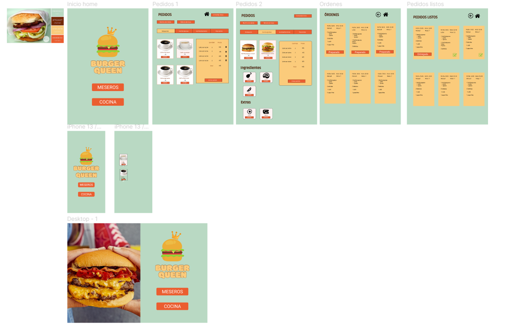

# Burger Queen

Un pequeño restaurante de hamburguesas, que está creciendo, necesita una interfaz en la que puedan tomar pedidos usando una tablet, y enviarlos a la cocina para que se preparen ordenada y eficientemente (a través de un backend del que nos darán detalles más adelante).

push logrado

## Prototipo

## Link de pagina:
https://iconos8.es/icons/set/linkedin